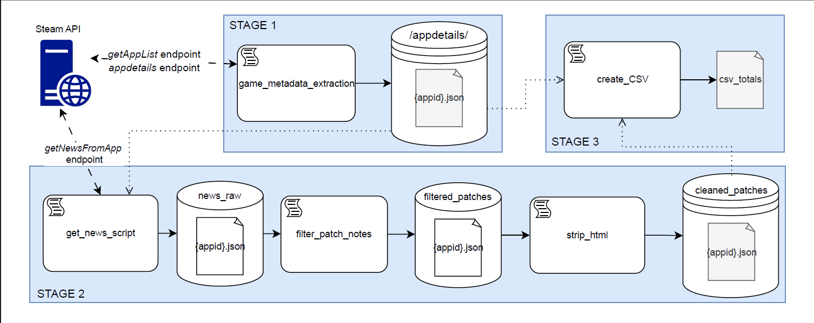
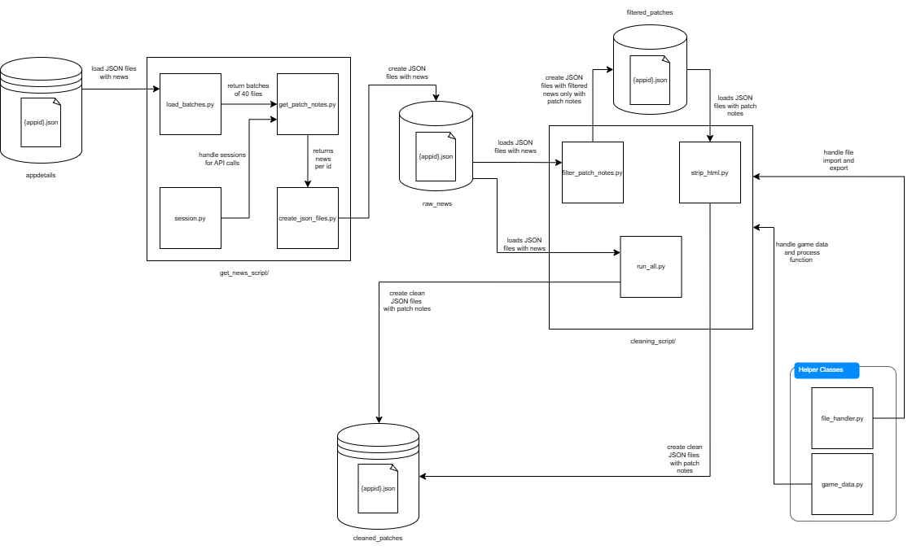

# A Large Dataset of Video Game Patch Notes

## Overview

This project aims to collect dataset of patchnotes for tiltles available of Steam and can be accessed by steamAPI. Metadata for **200,000+** titles from steam's API are collected and filtered. News for all the games is collected and filtered out to find **game patch notes** to make a large dataset of all the patchnotes for the respective games.

---
# 1.  Data Source Selection

### 📌 Data Source: Steam Platform

We chose **Steam** as our only data source. Steam is a digital distribution platform developed by Valve Corporation, and it's the **largest global platform for video games**.

### How representative and relevant is it?
* **Massive Coverage**: As of 2025, Steam hosted over **247,000 games**, ranging from AAA titles to indie releases.
* **High Engagement**: In 2025, the platform recorded **132 million monthly active users**.
* Most **major games** are available on Steam.
* The platform is **open to indie developers** (99% of games on steams are indie games), ensuring a broad representation of genres and development styles.

### Relevance for our study
* It provides a **comprehensive sampling frame** of the gaming ecosystem.
* Focusing on a single, dominant platform allows us to standardize the data retrieval process across a wide range of games and patch histories.

---

## Data Access & Limitations

### Access Method

We use the official **Steam Web API** to query data.

* API Documentation: [https://steamcommunity.com/dev](https://steamcommunity.com/dev)
* API Terms of Use: [https://steamcommunity.com/dev/apiterms](https://steamcommunity.com/dev/apiterms)

**Permissions**: usage of the Steam Web API is permitted under their terms of use, provided we remain compliant:
[Steam Web API Terms](https://steamcommunity.com/dev/apiterms)


### Limitations and Mitigations

| Limitation                                                     | Mitigation                                                                                  |
|----------------------------------------------------------------|---------------------------------------------------------------------------------------------|
| **API Rate Limit**: 100,000 calls/day (~200 calls/5 min)       | Implement an automated, incremental retrieval process to distribute requests across the day |
| **Data Noise**: Many app IDs are not games (DLCs, tools, etc.) | Implement filtering logic to include only actual games                                      |
| **Inconsistent Metadata**: Duplicate entries, changing appIDs  | Add validation and logging steps to identify inconsistencies                                |


We plan to **build a local dataset** representing the Steam game catalog, from which we can later sample games for collection of patch notes and analysis.

---

## A. Create the **Local Dataset** 

This step builds a local dataset of Steam games by querying the `appdetails` API and collecting selected metadata.

1. **Initial App List Retrieval**
   * Download the full list of app IDs from the Steam endpoint (includes games and non-game apps).
   * Save the list to [applist.json](output/applist.json).

2. **Filtering and Metadata Collection**

   * For each app ID in the list:

     * Query the `appdetails` API individually.
     * Record every query in [queries.json](.output/queries.json) to prevent redundant calls.
     * Check whether the app is categorized as a **game**.
     * If it is a game:

       * Extract basic metadata and store it locally in the folder [appdetails/](appdetails/).
       * Filenames follow the format: `{appid}.json`.
       * At this stage, only high-level metadata is collected (no patch notes or extended data).

   * This step is implemented in a Jupyter notebook: [game_metadata_extraction.ipynb](scripts/game_metadata_extraction.ipynb).
    > **Note:** Due to Steam API rate limits (100,000 calls/day, \~200 every 5 minutes), the script is designed to run incrementally over several days. It is intended to be launched once per app ID list.

3. **Metadata Formatting**

   * After metadata extraction, format the dataset as one CSV file: [games_metadata.csv](outputs/games_metadata.csv)
   * Each row represents a game, with the following metadata fields as columns:
     * _name,
     steam_appid,
     required_age,
     is_free,
     number_dlc,
     developers,
     publishers,
     price_currency,
     price_initial,
     price_final,
     windows,
     mac,
     linux,
     metacritic_score,
     categories,
     genres,
     recommendations_total,
     achievements_total,
     release_date_
   * The resulting CSV file is compatible with our internal **sampling tool**.
   * This step is implemented in a Jupyter notebook: [appdetails_to_csv.ipynb](./appdetails_to_csv.ipynb).
4. **Descriptive Stats** of the selected metadata
   * The columns of the CSV file are analysed to have insights on their content
   * This is implemented in a Jupyter notebook: [dataset_overview.ipynb](./dataset_overview.ipynb).

## B. Fetch News from SteamAPI
This step fetches news for each Steam games by querying the steam API as per game id and storing them into a local structured dataset.

1. Collecting IDs from **appdetails/** 
   * Collect IDs in the baches of 20-40 and pass them to the fetch call.
2. Fetching the news
   * Send IDs in small batches with time delays to not trigger steam's denial of service
   * A single ID can fetch for as many as **99999999999** news at a time which is the limit that is used.
3. Storing the data in JSON
   * Data for news is stored as JSON in [raw_news](patches/raw_news/) for each ID 
   * Filenames follow the format: `{appid}.json`.
   * Structure used for JSON is as following:
      ```
      {
         appId:
         count:
         notes:[
            {
               title:
               date:
               url:
               content:
            }
            ...
         ]
      }
      ```
## C. Extract and Clean **Patch Notes**

This stage filters and cleans patch notes extracted from Steam news. It consists of two substeps: (1) filtering relevant patch notes, and (2) cleaning their HTML content.

1. Filtering Patch Notes

For each game’s news file in [raw_news/](patches/raw_news/), titles and contents are scanned for relevant keywords. If matched, the news entry is considered a patch note and stored in [filtered_patches/](patches/filtered_patches/).

**Parsing and Keyword Matching**
* Parse all JSON files named **{appid}.json** in `raw_news/`
* Match significant keywords in the `title` or `content` fields:
  * patch(s), note(s), update, hotfix, release, added, changelog, change(s/ed),
    improved, bug(s), fix(es/ed)
* Matched entries are stored in the same JSON structure as `raw_news`

2. Cleaning Patch Notes

Patch note content retrieved from the Steam API often contains HTML tags and embedded code. These are cleaned to produce plain text data for analysis.

**Process**
* Parse all JSON files named **{appid}.json** in `filtered_patches/`
* Strip HTML tags and formatting from the `content` field
* Save cleaned data in [cleaned_patches/](patches/cleaned_patches/), preserving the same JSON structure as before

---

This results in a clean, structured dataset of patch notes suitable for further text analysis, sentiment study, or feature extraction.


### Data Pipeline Overview
The following diagram illustrates the full overview of data pipeline.



The following diagram illustrates the news collection, filtering and cleaning pipeline (STAGE 2)



---

## 📄 License

This project is licensed under the **Creative Commons Attribution 4.0 International (CC BY 4.0)** License.

You are free to:
- **Share** — copy and redistribute the material in any medium or format  
- **Adapt** — remix, transform, and build upon the material for any purpose, even commercially  

Under the following terms:
- **Attribution** — You must give appropriate credit, provide a link to the license, and indicate if changes were made.  
  You may do so in any reasonable manner, but not in any way that suggests the licensor endorses you or your use.  

🔗 **Full License Text:** [https://creativecommons.org/licenses/by/4.0/](https://creativecommons.org/licenses/by/4.0/)

© 2025 *A Large Dataset of Video Game Patch Notes* — Created by Saksham Tejpal, Cristiano Politowski and Jessie Galasso
